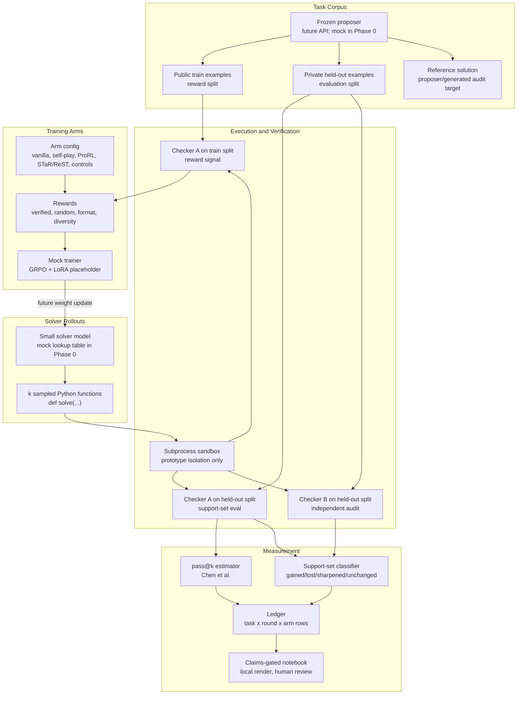

# Frontier Delta

A rigorous small-compute research system testing whether recursive self-improving LLM loops expand a model's support set or merely sharpen existing behavior.

**Status:** Phase 0 (Foundation) -- scaffold and mock loop.

**Research scope:** The research and development narrative is tied to
discoveries reviewed through the July 2026 cutoff. Papers, projects, or
benchmark results published after July 31, 2026 should be treated as new
evidence and evaluated before updating the design.

## Setup

```bash
# Clone
git clone <repo-url>
cd frontier-delta

# Create/update the locked uv environment.
uv sync

# Run tests
uv run python -m unittest discover -s tests -v

# Run proposer viability (mock, no GPU/network required)
uv run python scripts/00_proposer_viability.py
```

Phase 0 has no runtime dependencies beyond the Python standard library. `uv`
manages the local environment, Python version selection, and `uv.lock`.

## Current V1 Experiment

The mock loop runs on toy program-induction tasks. A mock proposer generates input-output examples for hidden functions (e.g., `lambda a, b: a + b`). A mock solver generates candidate Python functions. The sandbox executes them against held-out test cases. The verifier classifies each task as solved or unsolved, and the pass@k estimator produces unbiased solve rates. The ledger records per-problem solve counts, and the analysis module classifies tasks as gained/lost/sharpened/unchanged relative to baseline.

No real training happens in Phase 0 -- the mock trainer records what would be trained. This validates the full measurement pipeline before committing GPU resources.

## Architecture



### Loop Detail

1. **Task Proposal:** Frozen frontier model generates program-induction tasks with training examples and held-out test examples.
2. **Solver Rollouts:** Small trainable model generates k candidate Python functions per task.
3. **Sandbox / Checker A:** Candidates are executed against public training examples for rewards and held-out examples for evaluation.
4. **Rewards:** Configurable reward function -- binary correctness, diversity bonus, format-only, random, etc. -- assigned per experimental arm.
5. **Mock Trainer:** Records what a GRPO + LoRA training step would compute. In later phases, performs actual weight updates.
6. **Support-Set Eval:** Phase 0 uses a smoothed beta-binomial point estimate; later phases add posterior intervals. Tasks are classified as gained, lost, sharpened, or unchanged.
7. **Checker B:** Independent audit verifier checks for reward hacking, contamination, and disagreement with Checker A.
8. **Analysis / Ledger:** Accumulates per-round, per-arm statistics into a support-set transfer map.
9. **Claims-Gated Notebook:** Results rendered locally. Nothing posted without human review.

## Test Commands

```bash
# All tests
uv run python -m unittest discover -s tests -v

# Specific modules
uv run python -m unittest tests.test_passk -v
uv run python -m unittest tests.test_verifier -v
uv run python -m unittest tests.test_rewards -v
uv run python -m unittest tests.test_ledger -v

# Mock loop (no GPU/network)
uv run python scripts/00_proposer_viability.py
```

## Documentation

See [docs/](docs/) for:
- [Idea Development](docs/01-idea-development.md) -- rationale and constraints
- [Recursive Learning Map](docs/02-recursive-learning-map.md) -- taxonomy of approaches
- [Current Design](docs/03-current-design.md) -- full system design and experimental arms
- [Implementation Plan](docs/04-implementation-plan.md) -- phases, kill gates, compute budget
- [References](docs/05-references.md) -- linked bibliography

## License

Research code. License TBD.
